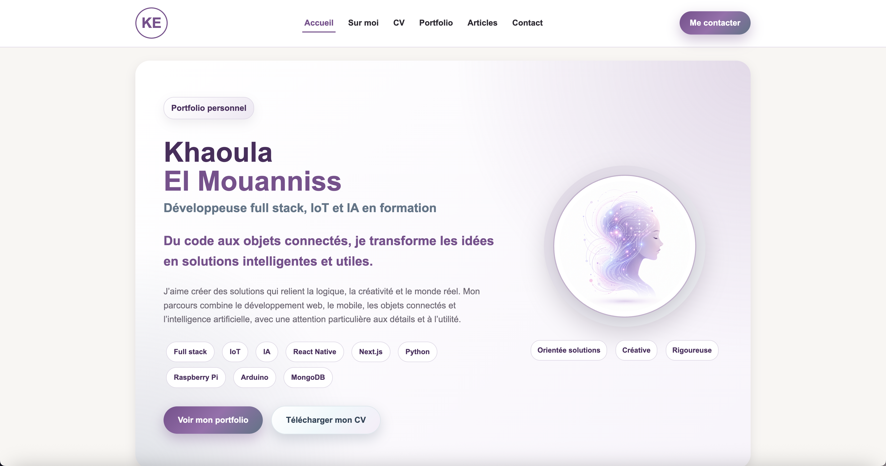

# Portfolio personnel - Khaoula El Mouanniss

Ce projet est un site web personnel de type portfolio/vCard réalisé en **HTML5**, **CSS3** et avec un peu de **JavaScript**.

Le site présente mon profil, mon parcours, mes compétences, mes projets, des ressources techniques et une page de contact.

## Aperçu



## Pages du site

Le projet contient 6 pages principales :

- `index.html` : page d'accueil
- `about.html` : page Sur moi
- `cv.html` : page CV
- `portfolio.html` : page Portfolio
- `articles.html` : page Articles / veille technologique
- `contact.html` : page Contact

## Technologies utilisées

- HTML5
- CSS3
- JavaScript simple
- GitHub Pages pour la publication

## Structure du projet

```
portfolio/
├── index.html
├── about.html
├── cv.html
├── portfolio.html
├── articles.html
├── contact.html
├── css/
│   ├── styles.css
│   ├── home.css
│   ├── about.css
│   ├── cv.css
│   ├── portfolio.css
│   ├── articles.css
│   └── contact.css
├── js/
│   └── script.js
├── images/
│   ├── accueil.png
│   ├── favicon.ico
│   ├── profile.png
│   ├── cake-design.png
│   ├── icons/
│   └── projects/
├── videos/
│   └── aquaequa-demo.mp4
└── documents/
    └── cv-khaoula.pdf

```

## Organisation du CSS

Le fichier `styles.css` contient les styles communs du site :

- variables CSS dans `:root`
- couleurs
- ombres
- arrondis
- header
- navigation
- boutons
- titres de section
- footer
- liens sociaux

Chaque page possède aussi son propre fichier CSS pour garder le code plus organisé et plus facile à modifier.

## Choix techniques

### Balises sémantiques

Le projet utilise des balises HTML5 comme :

- `header`
- `nav`
- `main`
- `section`
- `article`
- `footer`

Ces balises rendent la structure du site plus claire et plus facile à comprendre.

### Variables CSS

Les variables CSS sont définies dans `:root`, par exemple :

```css
--color-primary: #7b4f8f;
--color-background: #f8f6f2;
--shadow-soft: 0 0.5rem 1.25rem rgba(60, 45, 70, 0.12);
```

Elles permettent de réutiliser les mêmes couleurs et ombres dans tout le site.

### Flexbox

Flexbox est utilisé pour organiser plusieurs sections :

- la navigation
- les sections hero
- les cartes
- les colonnes du CV
- la page contact
- les grilles de projets et d’articles

### Unités utilisées

- `%` pour les largeurs flexibles
- `rem` pour les tailles, marges et espacements
- `px` pour les bordures fines
- `vh` pour limiter la hauteur de la popup vidéo

## Bonus ajoutés

### 1. GitHub Pages

Le site est publié avec GitHub Pages pour être accessible directement en ligne.

### 2. Effets hover et transitions CSS

Des effets `:hover` sont utilisés sur :

- la navigation
- les boutons
- les cartes
- les liens
- le bouton play de la vidéo

Les propriétés utilisées incluent :

```css
transition
transform
box-shadow
```

### 3. SEO

Des éléments SEO ont été ajoutés dans le `head` des pages :

- `title`
- `meta name="description"`
- `meta name="keywords"`
- `meta name="author"`
- `link rel="icon"`

Le site utilise aussi une structure de titres claire avec `h1`, `h2` et `h3` avec un seul `h1`par page, ainsi que des attributs `alt` pour les images.

### 4. JavaScript simple

La page Portfolio contient une popup vidéo pour le projet AquaEqua.

Le JavaScript sert à :

- récupérer les éléments HTML avec `document.getElementById()`
- écouter les clics avec `addEventListener()`
- ouvrir la popup avec `classList.add("active")`
- fermer la popup avec `classList.remove("active")`
- arrêter la vidéo avec `pause()`
- fermer la popup en cliquant sur le fond sombre avec `event.target`

## Comment lancer le projet localement

1. Télécharger ou cloner le projet.
2. Ouvrir le dossier dans VS Code.
3. Ouvrir le fichier `index.html` dans un navigateur.
4. Naviguer entre les pages avec le menu.

## Remarques

- Le formulaire de contact est une structure HTML/CSS statique.
- La vidéo du portfolio est intégrée localement dans le dossier `videos`.

## Autrice

Khaoula El Mouanniss
